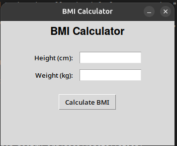
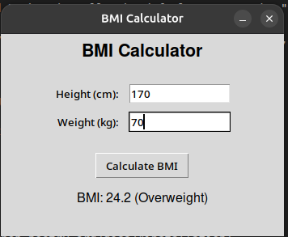

# BMI Calculator

## Body Mass Index (BMI)
Body Mass Index or BMI is a measure used to indicate the weight category of a person. This calculation method was initially developed in the 19th century by Adolphe Quetelet. Another term used for BMI is Quetelet index.

## Screenshots
| Initial View | In Use |
|:---:|:---:|
|  |  |

## Installation & How to Use

This project supports two execution modes: using **Poetry** (recommended) or a standard Python **Virtual Environment (venv)**.

### Prerequisites
This application requires `tkinter` for its Graphical User Interface.

- **Windows**: `tkinter` is included in the standard Python installer by default. Ensure the "tcl/tk and IDLE" option is checked when installing Python.
- **macOS**: `tkinter` is included if you install Python from python.org. If you use Homebrew, you can install it via:
  ```bash
  brew install python-tk
  ```
- **Linux (Ubuntu/Debian)**: Install via your package manager:
  ```bash
  sudo apt-get update && sudo apt-get install -y python3-tk
  ```

---

### Option 1: Using Poetry

1. Make sure you have [Poetry installed](https://python-poetry.org/docs/#installation).
2. Install the project dependencies:
```bash
poetry install
```

3. Run the GUI Application:
```bash
poetry run bmi-calculator
```

---

### Option 2: Using standard Python venv

1. Create a virtual environment:
```bash
python3 -m venv venv
```

2. Activate the virtual environment:
- On Linux/macOS:
  ```bash
  source venv/bin/activate
  ```
- On Windows:
  ```bash
  venv\Scripts\activate
  ```

3. Install dependencies from `requirements.txt`:
```bash
pip install -r requirements.txt
```

4. Run the application:
```bash
python main.py
```
